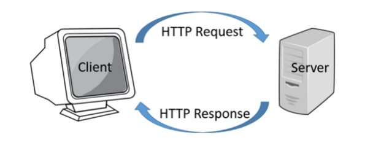
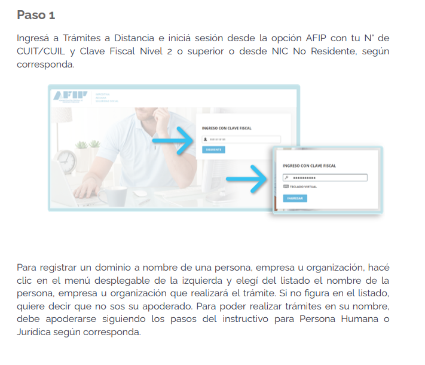
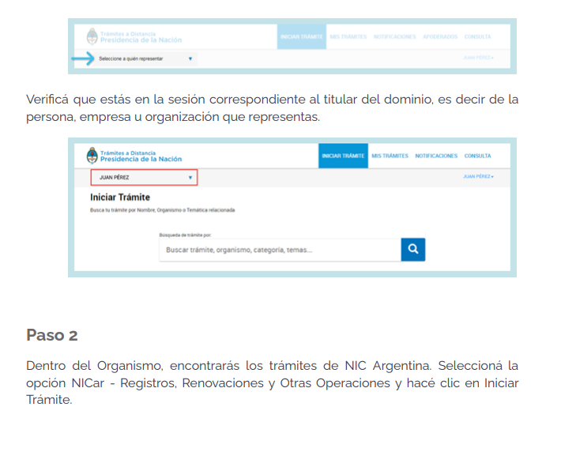
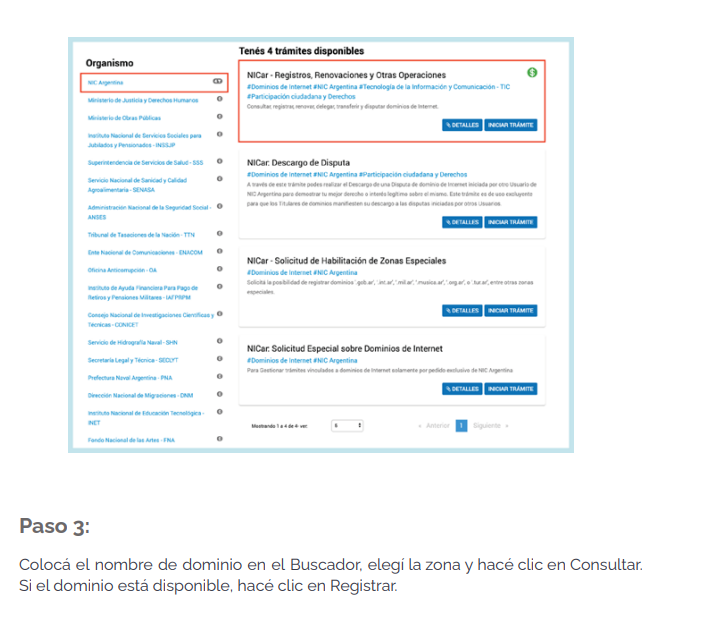
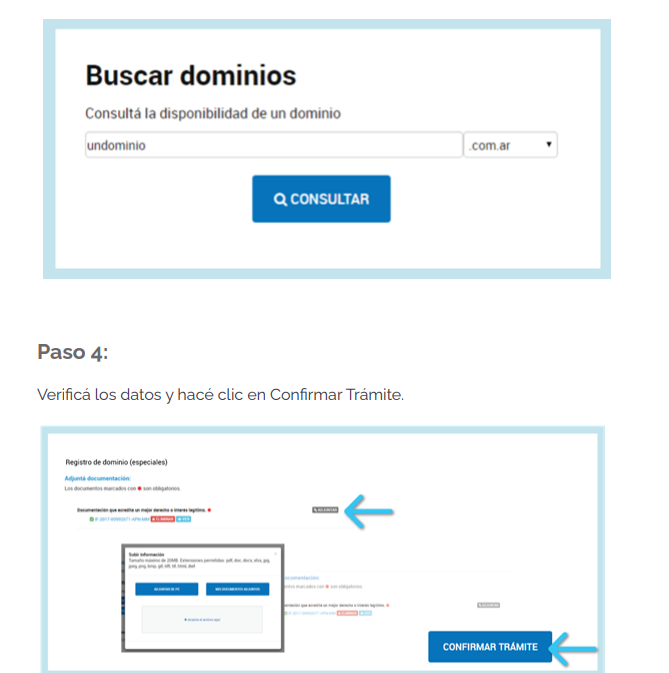
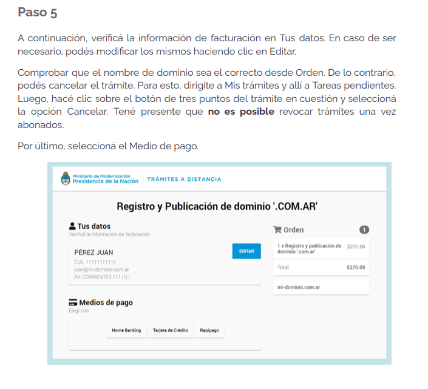
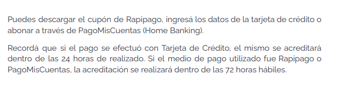
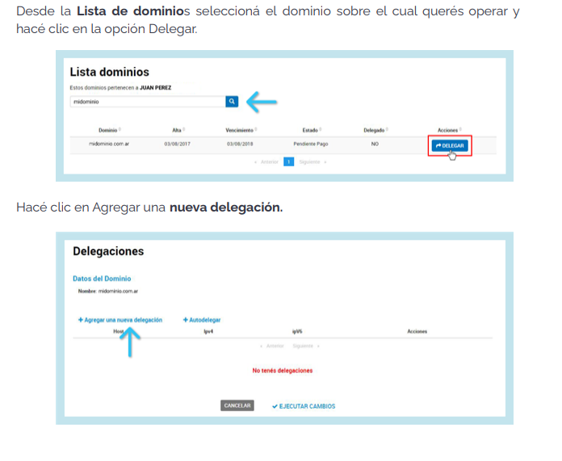
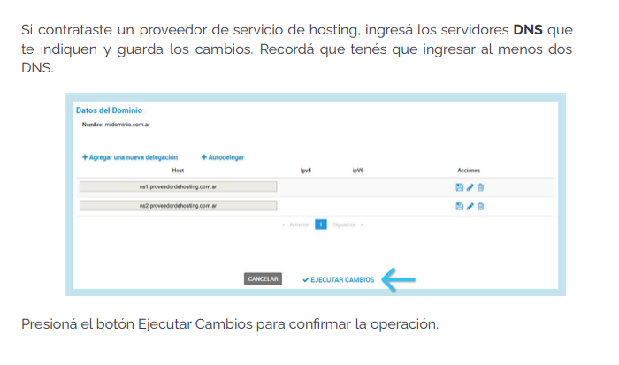

1. HTTP 
Hypertex Transfer Protocol (HTTP) es un protocolo de la capa de aplicacion para la transmision de documentos hipermedia como html.
Fue diseñado para la comunicacion entre navegadores y servidores web, aunque puede ser utilizado para
otros propositos.

Sigue el modelo cliente-servidor, en el que un cliente establece una conexión, realizando una peticion al servidor, y obteniendo una respuesta del mismo.

Es un protocolo sin estado, el servidor no guarda ningun dato entre dos peticiones

2. Dominios
Es el nombre unico e irrepetible que se le da a un sitio de Internet para que las marcas dueñas del sitio puedan identificarlas de forma comoda y sencillas, asi mismo como los usuarios y los clientes

Un dominio de Internet se forma a aprtir de dos elementos principales, el nombre del dominio, por ejemplo, para el sitio dantebeltran.com.ar, tiene un nombre de dominio (dantebeltran) y la extension del dominio (.com.ar). Cuando una empresa o persona compra un dominio web, puede especificar a que servidor apunta el nombre de dominio.

Los registros de nombres de dominios son supervisados por una organización llamada ICANN (Corporación de INternet para Nombres y Números Asignados). ICANN especifica que extensiones de dominios estan disponibles y mantiene una base de datos cen tralizada de donde apuntan los dominios web.

Pero, ¿Como funcionan estos?
Los dominios funcionan actuando como un atajo para llegar al servidor que aloja tu sitio web
Sin un dominio, cualquiera que quisiera visitar tu sitio, tendria que escribir la dirección IP completa, pero estas son dificiles de memorizar, y poseen mal marketing.
Registrar un dominio en internet es el primer paso para tener presencia en la web, aunque, con solo un dominio no se puede publicar un sitio web, sino que tambien se necesita un web hosting.

Existen diferentes tipos de dominios, como lo son:
    ● .com = Sitio comercial
    ● .net = Empresa de servicios de Internet
    ● .org = Organización sin fines de lucro
    ● .info = Sitio informativo
    ● .biz = Sitio de negocios
    ● .gob = Entidades Gubernamentales
    ● .ar = dominios territoriales de Argentina
    ● etc

¿Como puedo registrar mi dominio?
Los diferentes proveedores de nombres de dominios utilizan diferentes sistemas, así que aunque esta respuesta cubre el proceso en general, puede variar ligeramente segun el proovedor.
Por lo general, se empieza a buscar el dominio, la mayoria de los proovedores permiten una busqueda del mismo para ver si esta disponible.

¿Donde puedo registrar un .com.ar?
NIC Argentina es la encargada de registrar dominios .com.ar ya que forma parte del modelo de multiples actores (multistakeholde model) de ICANN

Para operar ahi necesito:
    ● N° de CUIT/CUIL
    ● Clave Fiscal Nivel 2 o superior

Si quisiera hacer un dominio en una zona especial, como .gob.ar, .int.ar, musica.ar, etc, debo de hacer el Tramite de habilitación de zonas especiales y ademas solo pueden ser registrados por personas juridicas

Para tener un paso a paso, seguir las siguientes imagenes

Delegación de Dominios
La delegación del dominio es la configuración de DNS (Domain Name System - Sistema de Nombres de Dominio) que debe asociarse a un nombre de dominio para relacionarlo con el servicio de hosting que almacenara la información del sitio web, correo electronico, etc.

Para configurar una desde NIC, seguir los siguientes pasos

3. Hosting

Cuando se decide crear un nuevo sitio web, se tiene que encontrar una empresa de hosting que proporcione espacio en un servidor, el proveedor de hosting almacena todos los archivos, medios y bases de datos en el servidor. Cada vez que alguien escribe tu nombre de dominio en la barra de direcciones de su navegador, el servidor transfiere todos lso archivos necesarios para atender la solicitud.

Se debe elegir el plan de hosting que mejor se adapte a las necesidades y comprarlo. De hecho, el hosting web funciona de manera similar a una empresa de celular con los planes de servicio.

Las cuentas de hosting vienen con una interfaz de usuario grafica donde se puede administrar todos los aspectos del sitio web

Los proveedores de hosting tambien pueden ofrecer otros servicios relacionados con la administracion del sitio web (por ejemplo, crear cuentas de correo web)

Los hosting proporcionan los datos de FTP para la subida de archivos y los datos de las delegaciones (DNS)

En este curso se utilizara un hosting gratuito para tener una nocion de como funcionan, este se llama 000webhost
https://www.000webhost.com/
Aqui, nos creamos una cuenta gratuita, verificamos el mail, le damos a create web design, other y procedemos a cargarle datos:

nombre-> (tunombre+estudios+año)
contraseña generada automatica

