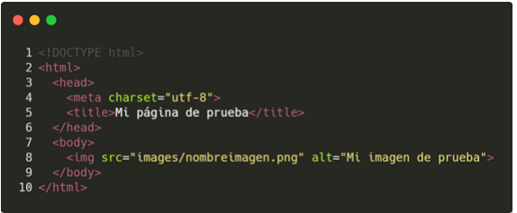
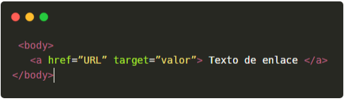

1. ¿Que es HTML?
HTML es un lenguaje de marcado, significa Hypertext Markup Language

Los documentos HTML se encuentran estrictamente organizados. Cada parte del documento esta diferenciada, declarada y determinada por etiquetas especificas

Estas mismas tienen inicio y cierre para los diferentes formatos que se quieren aplicar, de esta forma se indica cuando empieza y finaliza el formato

Por ejemplo, < p >Indica texto de parrafo < /p > (no van espaciados, pero por formato de texto los pongo así)
< title > Es la etiqueta donde se coloca el titulo de una pagina < /title >

Su estructura se divide por Etiqueta de apertura, contenido y etiqueta de clausura

El conjunto de esta estructura se le llama "elemento"

2. Estructura basica de un documento
La estructura basica para comenzar a trabajar es la siguiente

< !DOCTYPE html > se encarga de definir el tipo de documento
< html > < /html > Especifica el principio y fin del documento HTML.
< head > < /head > Es un contenedor de todo aquello correspondiente a la pagina HTML, pero no es contenido visible por los visitantes, esto puede ser, su titulo, codigo CSS, keywords, descripciones, etc...
< meta charset="utf-8" > Indica el juego de caracteres con el que se trabajara en el documento, en este caso, utf-8, que es el mas completo
< title > Es la etiqueta donde se coloca el titulo de una pagina < /title >
< body > < /body> Es donde se encuentra todo el contenido que si deseo que vean los visitantes de la pagina, puede ser texto, imagenes, videos, audios, formularios, etc...

Etiquetas
<ol>
    <li>
    De h1 a h6
    Hay 6 tipos de encabezados o titulos diferentes, estos estan representados por un valor numerico entre 1 y 6, que estan siguiendo auna h
    Del 1 al 3, suelen ser tamaños mayores que la letra establecida o default, y del 4 al 6, menores
    </li>

    <li>
    p
    Se utiliza para encerrar parrafos de texto
    </li>

    <li>
    ul
    Permite definir una lista desordenada, esta etiqueta a su vez es contenedora de otras etiquetas, las cuales son <li> < /li >, que estas representan cada elemento dentro de la lista.
    Tambien, para hacer una lista ordenada, puedo usar la etiqueta ol (ul = unordered list && ol = ordered list)
    </li>

    <li>
    a
    Sirve para definir y crear un hipervinculo, es decir, enlazar un documento web con otro.
    Por defecto, esta conlleva una sintaxis, con parametros dentro que es importante desarrollar
    
    href: Este atributo establece la URL en la que se encuentra el documento al cual quiere dirigir esta etiqueta, puede ser absoluta, relativa o un enlace en el mismo documento
    target: Este atributo permite especificar el destino por defecto para los enlaces, el mas comun es _blank, que especifica que se abra el nuevo documento en una nueva pestaña
    </li>

    img
</ol>