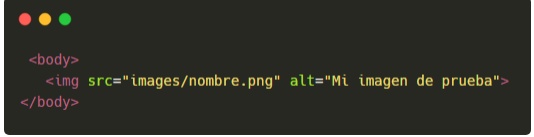
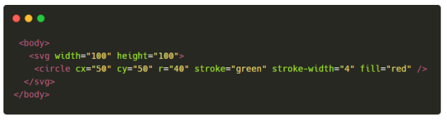
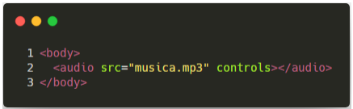
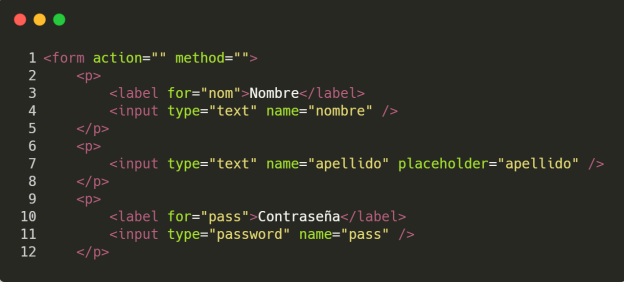
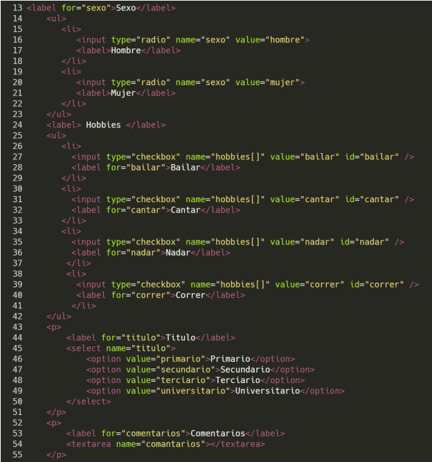
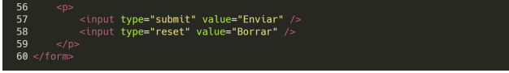

1. ¿Que es HTML?
HTML es un lenguaje de marcado, significa Hypertext Markup Language

Los documentos HTML se encuentran estrictamente organizados. Cada parte del documento esta diferenciada, declarada y determinada por etiquetas especificas

Estas mismas tienen inicio y cierre para los diferentes formatos que se quieren aplicar, de esta forma se indica cuando empieza y finaliza el formato

Por ejemplo, < p >Indica texto de parrafo < /p > (no van espaciados, pero por formato de texto los pongo así)
< title > Es la etiqueta donde se coloca el titulo de una pagina < /title >

Su estructura se divide por Etiqueta de apertura, contenido y etiqueta de clausura

El conjunto de esta estructura se le llama "elemento"

2. Estructura basica de un documento
La estructura basica para comenzar a trabajar es la siguiente

< !DOCTYPE html > se encarga de definir el tipo de documento
< html > < /html > Especifica el principio y fin del documento HTML.
< head > < /head > Es un contenedor de todo aquello correspondiente a la pagina HTML, pero no es contenido visible por los visitantes, esto puede ser, su titulo, codigo CSS, keywords, descripciones, etc...
< meta charset="utf-8" > Indica el juego de caracteres con el que se trabajara en el documento, en este caso, utf-8, que es el mas completo
< title > Es la etiqueta donde se coloca el titulo de una pagina < /title >
< body > < /body> Es donde se encuentra todo el contenido que si deseo que vean los visitantes de la pagina, puede ser texto, imagenes, videos, audios, formularios, etc...

Etiquetas
    De h1 a h6
    Hay 6 tipos de encabezados o titulos diferentes, estos estan representados por un valor numerico entre 1 y 6, que estan siguiendo auna h
    Del 1 al 3, suelen ser tamaños mayores que la letra establecida o default, y del 4 al 6, menores

    p
    Se utiliza para encerrar parrafos de texto

    ul
    Permite definir una lista desordenada, esta etiqueta a su vez es contenedora de otras etiquetas, las cuales son <li> < /li >, que estas representan cada elemento dentro de la lista.
    Tambien, para hacer una lista ordenada, puedo usar la etiqueta ol (ul = unordered list && ol = ordered list)

    a
    Sirve para definir y crear un hipervinculo, es decir, enlazar un documento web con otro.
    Por defecto, esta conlleva una sintaxis, con parametros dentro que es importante desarrollar

    href: Este atributo establece la URL en la que se encuentra el documento al cual quiere dirigir esta etiqueta, puede ser absoluta, relativa o un enlace en el mismo documento
    target: Este atributo permite especificar el destino por defecto para los enlaces, el mas comun es _blank, que especifica que se abra el nuevo documento en una nueva pestaña

    img
    Esta etiqueta permite definir una imagen dentro de un documento web.
    No posee tecnicamente la imagen dentro del documento, sino, que tiene un enlace a una imagen que esta dentro del proyecto, y la situa en el propio documento, los formatos mas comunes que suele tener son JPEG y PNG, pero puede tener muchos más

    src: especifica la ruta de origen de la imagen
    alt: da un texto alternativo que se muestre en caso de que no pueda cargar la imagen por diversos motivos, o si el usuario tiene un lector de pantalla

    svg
    Graficos vectoriales escalables (SVG) es un lenguaje de marcado XML para describir graficos vectoriales en dos dimensiones. Basicamente, es a los graficos lo que HTML es al texto
 

    div
    Esta etiqueta se encarga de crear secciones o agrupar contenido

3. Etiquetas semanticas

    Estas etiquetas sirven para organizar los contenidos del documento en partes logicas
    

    header
    Representa un grupo de ayudas introductorias o de navegación, puede contener elementos de encabezado, logo, nombre de autor, formulario de busqueda, entre otros componentes

    nav
    Representa una sección de la pagina cuyo proposito es proporcionar enlaces de navegación, ya sea dentro del documento actual a otros documentos

    aside
    Representa una seccion de una pagina que consiste en contenido que esta indirectamente relacionado con el contenido principal del documento. Estas son a menudo representadas como barras laterales o inserciones y contienen una explicación al margen como una definición de glosario, elementos relacionados indirectamente como publicidad, biografia del autor, información de perfil a enlaces o blogs relacionados, etc.

    footer
    Permite definir un pie de pagina de un documento, contiene información acerca de los datos de derechos de autor o enlaces a documentos relacionados, iconos de redes sociales, etc.

    main
    Representa el contenido principal del documento, el area principal del contenido consiste en el contenido que esta directamente relacionado, o se expande sobre el tema central de un documento o la funcionalidad central de una aplicación, es unico en el documento

    section
    Representa una sección generica de un documento. Sirve para determinar que contenido corresponde a que parte de un esquema. Piensa en el esquema como en el indice de contenido de un libro; un tema común y subsecciones relacionadas.

    article
    Permite especificar contenido independiente o autonomo, Su posible utilización puede ser mensajes de foros, noticias, comentarios, etc.

4. Etiquetas multimedia

    audio
    Se usar para insertar contenido de audio en un documento html,  posee como parametros "src" que funciona igual que en los demas, utilizando como extensión .mp3, y controls, que puede o no estar presente, pero en caso de estarlo, ofrece controles para permitir que el usuario controle la reproducción del video, pudiendo pasuarlo, cambiar volumen, etc.
    

    video
    Lo mismo que el audio, pero se encarga de transmitir videos, su extensión es .mp4, y ademas, posee otro parametro llamado "poster", el cual se encarga de darle una "miniatura" al video.

5. Formularios
    form
    Permite definir un formulario de datos, utilizados para transferir datos al servidor, este puede contener elementos de entrada como campos de texto, checkboxes, botones de radio, de envio, listas de seleccion, etc.

    input
    Es una de las etiquetas pas importantes para la solicitud de datos mediante formularios, ya que es la que permite especificar los tipos de datos que se queiren solicitar para su posterior envio
    Hay muchos tipos de inputs, los cuales son:
        text: Campo de texto de linea simple.
        checkbox: Casilla de selección que puede ser marcada o no (booleano)
        file: Espacio para enviar algun archivo
        hidden: No es mostrado en pantalla, pero tiene un valor que sera enviado al servidor
        password: Linea de texto que permanece oculta
        radio: Conjunto de "checkboxes" dentro de un mismo grupo, del cual se puede seleccionar solo uno

    label
    Representa una etiqueta para un elemento en una interfaz de usuario

    select
    Representa un control que muestra un menu de opciones, estas mismas son representadas por < option >

    textarea
    Representa un control para la edicion miltulinea de texto sin formato
    
    
    