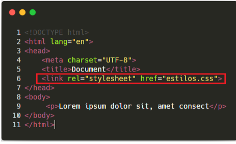
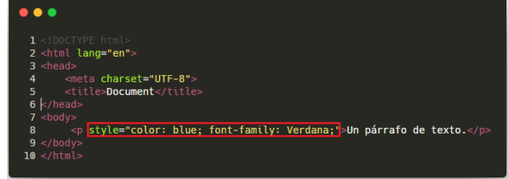
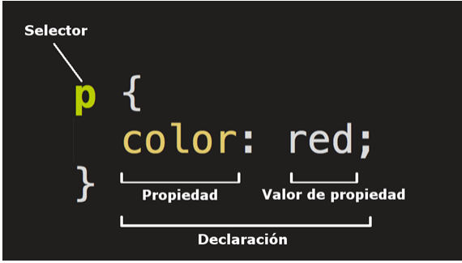

1. CSS

El CSS es un lenguaje de estilos empleado para definir la presentación, el formato y la apariencia de un documento html.

Las hojas de estilos nacen de la necesidad de diseñar la información de tal manera que podamos separar el contenido de la presentación y, asi por una misma fuente de información, generalmente definida mediante un lenguaje de demarcación, ofrecer diferentes presentaciones en función de dispotiviso, servicios, contextos o aplicativos.

La especificación de css se encuentra aquí:
http://www.w3c.org/

2. Como lo incluimos en el documento HTML?
Hay tres formar de incluirlo en un HTML.
Empleando la etiqueta < style >, dentro del head, y podemos ahi mismo, escribir el codigo, de la siguiente manera:

Sino, podemos usar la etiqueta < link >, pasando como parametro rel="stylesheet", y con un href que lleve a la coordenada del css, de la siguiente manera

Como ultimo metodo, podemos dentro de cada tag particular, ya sea un < p >, darle un parametro style="" que tenga dentro un codigo css

3. Estructura de la regla

Selector: indicas el elemento html que sera afectado por las siguientes propiedades.
Declaración: especificas las propiedades del elemento que vamos a cambiar
Propiedad: parte de la declaración, especificamente, es la propiedad que sera cambiada del elemento
valor de la propiedad: el valor por el que la propiedad sera alterado

4. Selectores

Existen diferentes tipos de selectores que se pueden utilizar en un sitio web

Estos son:

Etiqueta o tipo: Son todos los elementos del html que tengan esta etiqueta, por ejemplo, la etiqueta < p >
que en CSS se le asigna valor de la siguiente forma
p{
    atributo:valor
}

Identificador: Modifica un elemento unico, que es el id que tiene cualquier etiqueta, por ejemplo 
< div id="identificador"> </ div>
Y en CSS se le asigna valor así
#identificador{
    atributo:valor
}

Clase: Son muy similares a los identificadores, pero llaman a todos los elementos que la posean, usan el parametro "class" en HTML, y se les llama con un . en lugar de un # en el CSS
En HTML
< div
class=”destacados”>
</ div>

En CSS
.destacados{
atributo:valor;
}

Pseudoclase,: Se aplican a Etiquetas, pero cuando cumplen requisitos, como un onHover (apoyar mouse arriba), onClick, etc.

se llama con un :

p:hover{
    atributo:valor
}

5. Propiedades Basicas

Podemos encontrar como propiedades, o atributos basicos, a los siguientes
● font-family: se refiere a la(s) fuente(s) que deseamos usar en nuestro texto.
● font-size: define tamaño de la fuente
● color: color de la fuente
● text-align: alineación de los textos.
● background-color: cambiar el color de fondo del elemento..
● width: establece el ancho.
● height: establece el alto.
● border: no permite definir el aspecto de cada uno de los cuatro bordes
horizontales y verticales de los elementos. Para cada borde se puede
establecer su anchura, color y/o estilo.
● margin: define cuatro propiedades para controlar cada uno de los márgenes
horizontales y verticales de un elemento.(margin-top margin-right
margin-bottom margin-left)
● padding: define cuatro propiedades para controlar cada uno de los espacios
de relleno horizontales y verticales de un elemento. Cada una de las
propiedades establece la separación entre el lateral de los contenidos y el
borde lateral de la caja.

6. Colores Hexadecimales o RGB/a

En la web se utilizan colores hexadecimales o RGB/a

Hexadecimales
Se define el color mediante el sistema numerico hexadecimal, en el cual cada par de numeros representa su respectivo color en Red,Green y Blue, se lo llama de la siguiente manera
p{
    color: #f08080
}

Colores RGBa
A este modelo, directamente le damos el valor entre 1 y 255 de Rojo, Verde y Azul, ademas de un posible cuarto parametro, que aclare transparencia
p{
    color: rgba(255,0,255,0.5)
}

7. Unidades de medida

px: es un pixel, es la unidad minima de la resolución de pantalla
p{
    font-size: 20px;
}

rem: El rem depende del tamaño de la letra base, sino definimos ninguna font size en el html, toma el valor del navegador. el cual es 1 rem = 16px, si queremos que un titulo tenga 25 px, le asignamos un valor de 1.5rem
p{
    font-size: 1.5rem;
}

em: Igual al rem, pero responde al ultimo font-size que se aclaro en su arbol en el que se encuentra, este es escalable y siempre depende de su padre