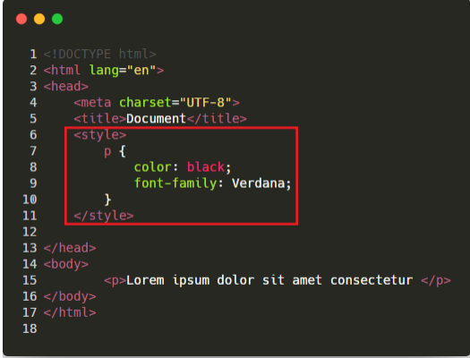

1. CSS

El CSS es un lenguaje de estilos empleado para definir la presentación, el formato y la apariencia de un documento html.

Las hojas de estilos nacen de la necesidad de diseñar la información de tal manera que podamos separar el contenido de la presentación y, asi por una misma fuente de información, generalmente definida mediante un lenguaje de demarcación, ofrecer diferentes presentaciones en función de dispotiviso, servicios, contextos o aplicativos.

La especificación de css se encuentra aquí:
http://www.w3c.org/

2. Como lo incluimos en el documento HTML?
Hay tres formar de incluirlo en un HTML.
Empleando la etiqueta < style >, dentro del head, y podemos ahi mismo, escribir el codigo, de la siguiente manera:

Sino, podemos usar la etiqueta < link >, pasando como parametro rel="stylesheet", y con un href que lleve a la coordenada del css, de la siguiente manera

Como ultimo metodo, podemos dentro de cada tag particular, ya sea un < p >, darle un parametro style="" que tenga dentro un codigo css

3. Estructura de la regla

Selector: indicas el elemento html que sera afectado por las siguientes propiedades.
Declaración: especificas las propiedades del elemento que vamos a cambiar
Propiedad: parte de la declaración, especificamente, es la propiedad que sera cambiada del elemento
valor de la propiedad: el valor por el que la propiedad sera alterado

4. Selectores