1) ¿Cuáles son los nombres y la ocupación de cada uno de los empleados? 
SELECT nombre, trabajo FROM empleados;

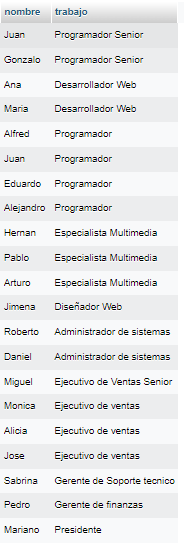

2) ¿Cuál es el nombre y la edad de cada uno de los empleados?
SELECT nombre, edad FROM empleados;

3) ¿Cuál es el nombre y la edad de todos los programadores?
SELECT nombre, edad FROM empleados WHERE trabajo LIKE '%programador%'

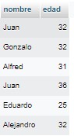

4) ¿Cuáles son los empleados de mas de 30 años?
SELECT * FROM empleados where edad > 30;

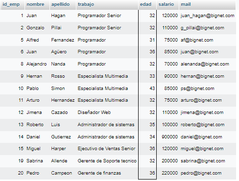

5) ¿Cuál es el apellido y el mail de los empleados llamados Juan?
SELECT apellido, mail FROM empleados where nombre LIKE 'Juan';

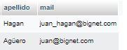

6) ¿Cuál es el nombre de las personas que trabajan como Programadores o Desarrolladores Web?
SELECT nombre FROM empleados WHERE trabajo LIKE '%Programador%' OR trabajo LIKE '%Desarrollador Web%';

7) Mostrar una lista (id_emp, nombre, apellido, trabajo) de las personas cuyo numero de empleado esté entre 15 y 20.
SELECT id_emp, nombre, apellido, trabajo FROM empleados WHERE id_emp >14 and id_emp < 21

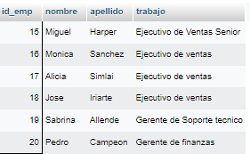

8) ¿Cuáles son los Programadores que ganan menos de $80000?
SELECT * from empleados WHERE salario < 80000;

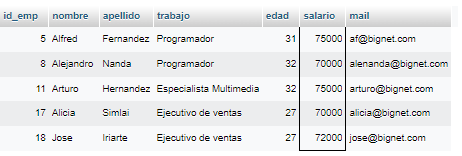

9) ¿Cuáles son los Programadores que ganan entre $75000 y  $90000?
SELECT * from empleados WHERE salario > 74999 and salario < 90001;

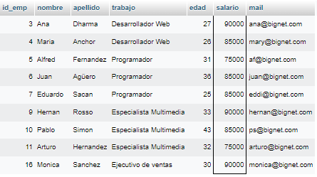

10) ¿Cuáles son los trabajadores cuyo apellido comienza con S?
SELECT * from empleados WHERE apellido LIKE 'S%';

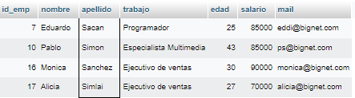

11) ¿Cuáles son los trabajadores cuyo nombre termina en l?
SELECT * from empleados WHERE nombre LIKE '%l';

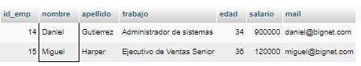

12) Agregar un empleado con ID_empleado 22 con los siguientes datos: Francisco Perez,  Programador, 26 años, salario 90000, mail: francisco@bignet.com.
INSERT INTO empleados (id_emp, nombre, apellido, trabajo, edad, salario, mail)
VALUES (22, 'Francisco', 'Perez', 'Programador', 26, 90000, 'francisco@bignet.com');

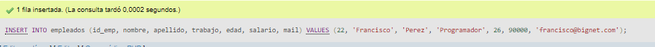

13) Borrar los datos de Hernan Rosso.
DELETE FROM empleados
WHERE nombre = 'Hernan' AND apellido = 'Rosso';

14) Modificar el salario de Daniel Gutierrez a 90000.
UPDATE empleados
SET salario = 90000
WHERE nombre = 'Daniel' AND apellido = 'Gutierrez';

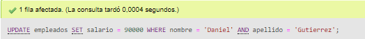

