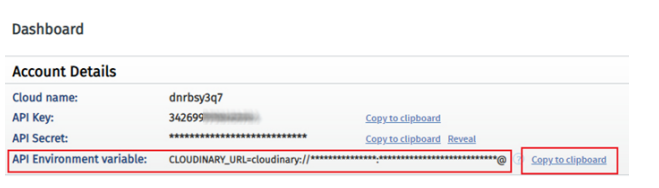
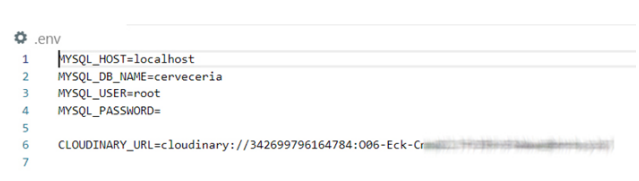

CRUD Parte 3

1. Subida de archivos
   Nuestro sitio web permitirá al administrador subir imagenes a las noevdades que ya tenemos implementadas. Para esto será necesario hacer algunas modificaciones en el código y estructura de base de datos que ya tenemos.

   Necesitaremos primero instalar algunas dependencias nuevas:

   express-fileupload

   Esta dependencia nos permite mediante un middleware capturar y manipular archivos subidos mediante formularios a nuestro sitio web

   Esto lo hacemos con "npm i express-fileupload"

cloudinary

Utilizamos el servicio gratuito de Cloudinary (https://cloudinary.com/) para alojar y manipular las imagenes que se vayan subiendo a las novedades. La dependencia la instalamos así:

"npm i cloudinary"

Para poder utilizar el servicio necesitamos registrarnos en el sitio y, una vez terminado este proceso, copiar el valor de API Environment variable a nuestro archivo .env con el nombre CLOUDINARY_URL

Agregar imagenes a las novedades

Paso 1

Incluimos la dependencia de express-fileupload y los configuramos como middleware de nuestra aplicación de express.

Es importante configurar el uso de archivos temporales a fin de que podamos una vez subidos enviarlos al servidor Cloudinary donde quedarán almacenados

Paso 2

Agregamos en la tabla de novedades la columna img_id con el tipo de datos varchar, cantidad de caracteres 250 ytildamos la opción NULL (para permitir la carga de novedades sin imagenes)

Paso 3

En el archivo view/admin/agregas.hbs, agregamos en la etiqueta form el atributo enctype con el valor multipart/form-data

Esto hara que el formulario envie no solo los campos que veniamos usando hasta ahora, sino que tambien los archivos incluidos.

Debajo de la etiqueta input cuerpo agregamos el input del tipo file para poder adjuntar la imagenes y le ponemos de nombre imagen

Paso 4

Modificamos nuestro archivo routes/admin/novedades.js e incluimos tanto la dependencia de cloudinary como la de util que usaremos para convertir el metodo upload en una función asincronica

Dentro del controlador router.post (/agregar) vamos a verificar antes de enviar la imagen a nuestro modelo, inicializamos una variable img_id como vacía ademas chequeamos si existe el objeto files dentro de la petición y si incluye uno o mas objetos dentro suyo.

Esta es la función que realiza express-fileupload; agregar en la petición el objeto files, y dentro de el facilitarnos todos los inputs del tipo file que se hayan enviado con su nombre.

En caso de que se hayan enviado archivos, buscaremos uno llamado imagen y utilizaremos la ruta temporal donde fue almacenado en nuestra computadora como archivo de origen para enviar el uploader de Cloudinary. Por ultimo, al completarse la subida a cloudinary guardamos el valor de la propiedad public_id en nuestra variable img_id.

Este proceso hace que la variable img_id que enviamos junto con el resto de los campos a la basen de datos, solo contenga un valor (el id publico que cloudinary asigno a nuestra imagen y que necesitaremos mas adelante para obtenerla y manipularla) en caso de que se haya subido una imagen, caso contrario enviamos un valor vacio y la novedad queda sin imagen.

Mostrar imagenes en el listado de administrador

Paso 1

En el archivo routes/admin/novedades.js agregamos la logica necesaria para enviar junto con cada novedad la imagen que se haya subido en caso de haber una o nada en caso de no tener.

Para esto utilizamos el metodo image de cloudinary que nos devuelve una etiqueta img html completa

Paso 2

Finalmente, en el archivo view/admin/novedades.hbs agregamos en el bucle each la variable de la imagen con triple llave debido a que puede contener HTML

Modificar una novedad con imagen

Paso 1

Modificamos views/admin/modificar.hbs e incluimos un input para enviar la imagen. A diferencia del formulario de agregar, incluimos una de tipo checkbox para permitir eliminar la imagen actual

Es neceasrio tambien que incluyamos un input del tipo hidden para enviar junto con el formulario, el id de la imagen actual si la hay

Paso 2

En el archivo routes/admin/novedades.js agregamos el metodo destroy de cloudinary que nos permite eliminar imagenes del servicio. Al igual que hicimos con el uploader utilizamos la libreria util para convertirlo en un metodo asincrono

El codigo para manejar la modificación de la imagen en la novedad puede parecer complejo a primera vista pero no lo es. Primero inicializamos la variable img_id con el valor que haya venido del input hidden y la variable borrar_img_vieja que usaremos para saber si tenemos que llamar al metodo destroy. De esta forma pase lo que pase, al enviar el valor a la base de datos preservamos el valor original.

A continuación, revisamos si el usuario decidió eliminar la imagen novedad, en cuyo caso, asignamos null a img_id para limpiar el valor de la base de datos.

Si el usuario no tildó la casilla para eliminar la imagen actual, repetimos el proceso que hicimos en agregar para ver si se envio una imagen junto con el formulario.

En el ultimo paso, revisamos el valor de borrar_img vieja y en caso de ser verdadero, ya sea porque el usuario tildo la casilla o subio una imagen nueva. llamamos al metodo destroy para eliminar la imagen antigua de cloudinary.

Al finalizar todo este proceso el valor de img_id contendrá una de tres opciones segun el camino que haya seguido el codigo, null, valor de input hidden o el id publico de una nueva imagen.

Paso 3

En la variable obj agregamos img_id para enviarlo a la base de datos junto con el resto de los campos

Para eliminar una imagen

Paso 1

En el archivo routes/admin/novedades.js dentro del controlador de la ruta que elimina las novedades vamos a verificar primero si la novedad tiene una imagen, en cuyo caso, como vamos a eliminar la novedad de nuestra base de datos, la eliminamos tambien de cloudinary con el metodo destroy.

2. Creación de API Rest
   Los API Rest son interfaces que las aplicaciones exponen para permitir la comunicación con otras y/o el consumo de datos controlado por parte de terceros.
   Muchas aplicaciones exponen sus servicios mediante la implementación de APIs Rest. permitiendonos utilizar funcionalidades o acceder a datos a los cuales de otra forma sería imposible acceder.

En el caso de nuestra aplicación crearemos un endpoint (asi se denomina cada URL que compone una API Rest) para exponer las novedades que se hayan cargado en la base de datos mediante el administrador. Esta sencilla API permitirá que nuestro sitio o cualquier otra aplicación (podría ser otro sitio o una aplicación de escritorio o para celulares) consuma nuestros datos

CORS

CORS (Cross-Origin Resource Sharing) es un mecanismo que utiliza cabeceras HTTP adicionales para permitir que un sitio obtenga permiso para acceder a recursos seleccionados desde un servidor en un origen distinto (dominio) al que pertenece. Es una practica de seguridad comun para rpevenir el uso no autorizado de recursos.

Instalamos la dependencia necesaria con el siguiente comando

npm i cors

Luego, importamos la nueva dependencia en nuestro archivo app.js

Para una mejor organización, vamos a separar todos los controladores para las rutas de nuestra API, en un nuevo router de express, para eso creamos un archivo nuevo routes/api.js y lo importamos en nuestro archivo app.js

Nuestro router se encargara de todas las rutas que empiezan con Api e implementa a modo de middleware la libreria de cors que instalamos. Esto permitira que cualquier ruta de nuestra API pueda ser consumida desde dominios diferentes al que aloje a nuestra aplicación.

En api.js podemos devolver resultados en formato json.

Devolver los datos de nuestra base de datos mediante la API, como se puede apreciar, es muy sencillo, solo debemos devolver como respuesta JSON el listado de novedades que nuestro modelo ha generado.

Para poder probar nuestra API podemos acceder a la ruta http://localhost:3000/api/novedades utilizando nuestro navegador podemos ver el contenido en un formato json

Una alternativa utilizada cuando desarrollamos APIs con muchos endpoints es Postman, esta se descarga aqui:

https://www.postman.com/downloads/

Manipulación de imagenes:

En nuestra API estamos devolviendo el id que nos da cloudinary, si queremos devolver la url de dicha imagen solamente debemos incorporar la libreria Cloudinary a nuestro codigo yconsultar las urls de las imagenes de las cuales tenemos el ID.

Nosotros aplicamos un recorte crop del tipo fill que redimensiona la imagen y elimina los excedentes utilizando tamaños proporcionados

Los nombres de las otras manipulaciones o efectos que son aplicables los podemos ver en la docu de Cloudinary
